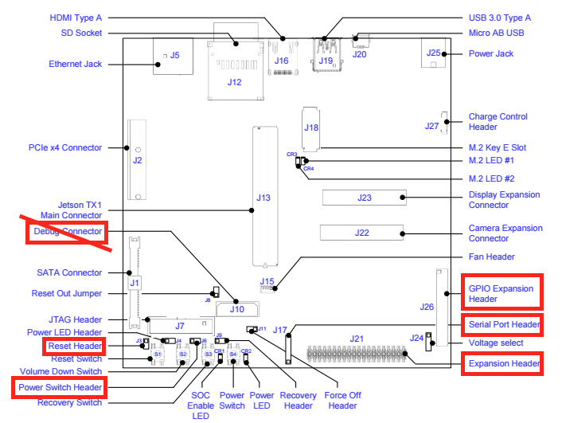

  This repo details the MSP430-based companion board for the MaSCOT project.  For a high-level overview, see [my blog](http://faculty.washington.edu/amarburg/site/mascot/)

NVidia Jetson TX1 Companion Board
=================================

__Project: IR&D Stereo Cameras__

__A. Marburg__

Introduction
------------

The standard Jetson motherboard has a number of features which are inconvenient when
the board is enclosed with limited access.  A companion board has been designed
to deal with some of these inconveniences, to provide an alternate RF connection
into the Jetson, and to provide a breakout for some of the more common expansion
headers on the Jetson motherboard.

Specification
-------------

The functional spec is:

**Status as of Rev 0.1 in bold**

* **Manage Jetson Power/state**
	* *Enable auto power-on.*	 Press power button a fixed delay after startup.   Interfaces directly with the power button.  The power control is an open-drain output on the Jetson (check on schematic).   The existing power switch on baseboard is mechanical switch to ground.   Use enhancement N-MOSFET as equivalent to pull bus to ground.  **Complete**
	* *Provide an out-of-band (OOB) way to reset the Jetson.* Uses reset button, see notes above about power button.  **(unable to pass DIO through Digi)**
	* *Deadman timer.*  Reset if no communications from Jetson after period of time.  Requires the micro to communicate with the Jetson --- will use I2C bus.  **(implemented, not tested, probably more trouble than its worth, just power-cycle the unit)**
* **Provide OOB communications.**  Use [Digi XBee](http://www.digi.com/products/xbee-rf-solutions/modules/xbee-802-15-4) (which happen to have sitting around).  **Complete**
	* *Reset the Jetson remotely.*  Use digital I/O on XBee to trigger the microcontroller.  **(unable to pass DIO through Digi)**
	* *OOB mechanism to manual disable the deadman.*  Use digital I/O on XBee.  **(unable to pass DIO through Digi)**
	* *Access Jetson serial console.*  Connection is via a 3v3 UART is 115200, with 8 bits, no parity, and 1 stop bit (115200 8N1), RTS/CTS.  It's on J21 pins 8,10 (Jetson pins UART0_*).  N.b. the Xbee has a nominal 250kbps data rate over-the-air.  **Complete**
* **Host supplemental sensors**
	* *Pressure / temp sensor.*  Bosch BMP280 on [Adafruit breakut board](https://www.adafruit.com/products/2651) with I2C interface.  The breakout includes a voltage regulator and level shifters which we can bypass.   Note this sensor connects to to I2C on the *Jetson*, not the micro. **Complete**
	* *Headers for supplemental temp sensors?* 4 pin headers for VDD/Gnd/SDA/SCL for add'l I2C sensors  **Yes, not used**
* **Break out Jetson baseboard pin headers**
	* *GPIO Header (J26).* **Yes**
	* *Expansion Header (J21).*  **Yes**
	* *Serial port (J17).* Jetson TX1 USART1_* at 3V3 **Yes**
	* *Debug header (J10)*   Uses dense Samtec connector, see below.  **No, not enough space**
* **Support electronics for MSP430 microcontroller**
	* *Header for in-circuit programming.*
* **LED Indicators.**
	* Deadman/heartbeat?
	* Communications received?
* **Board should be able to run standalone for debugging.**
	* LEDs for status/debug?  **Yes**
	* Power from debugger?  **Does work**
* **Power board from Jetson?**  Have checked, ~~3v3 is on all the time.~~ Needed to tap off 19VDC iput
* **Control BlueRobotics lights**
	* *Generate PWM.* Standard firmware in lights (they run Atmegas, btw) are off when signal line is pulled down, servo PWM for dimming, and on full when pulled high.  **Complete**

Electrical Design
------

The board accomplishes two primary functions.  First, it mates to and provide
breakouts for four of the expansion headers on the Jetson board:

Very briefly:

 * Debug connector (J10).   ~~Power and reset, as well as JTAG, UART and I2C (not used), primarily at 1v8.   This is a high density 0.5mm connector (Samtec QSH-30-01-L-D-A-TR).  The simplest interface appears to be putting the same connector on the companion board and using pre-made jumper cable from baseboard to companion board.~~  *Scratch that.  Too hard.  Use J6/J3 instead.*

The other three connectors are standard 0.1" pin headers.  The board will mount directly on these with female pinheaders on the bottom of the companion board.

* **Expansion header** (J21).  I2C, I2S, SPI, UART at 3v3.
* **GPIO** (J26).   GPIOs, mostly, some I2S
* **Serial Port** (J17).   Supplemental UART.  Notably, not the Jetson's console (this is on J21).  Not using, just breaking out.
* **Power switch** (J6).   Two-pin 0.1" connector with power-on signal and ground.  Short momentarily to power board on.
* **Reset** (J3).   Two-pin 0.1" connector with reset signal and ground.  Short momentarily to reset.

The companion board also hosts a MSP430 microprocessor.  As per the spec, this micro will:

 * Turns the Jetson on when power is applied
 * Provides an OOB connection to reset the Jetson
 * Provide PWM signals to the two Blue Robotics lights (under control of the Jetson)

The board also hosts a pressure/temperature sensor (Bosch BMP280), which interfaces to the
I2C on the Jetson (not on the microprocessor) and an XBee radio.  The XBee provides
wireless connectivity to the Jetson's serial console.  It can also communicate to the microcontroller via digital I/O (no serial interface to the micro).

Firmware Design
-----

Software Interface on Jetson
------

The Jetson communicates with the MSP430 over I2C.   The MSP430 appears as four
separate I2C devices.  All four addresses implement a very simple read-a-byte or write-a-byte interface.

The addresses are defined in [firmware/src/config.h](firmware/src/config.h)

| Address | Read | Write | Notes |
|---|---|
| 0x66 | (undefined) | Reset Jetson watchdog | (not currently used) |
| 0x12 | Light 1 PWM setting (0-255) | Light 1 PWM Setting |
| 0x13 | Light 2 PWM setting (0-255) | Light 2 PWM Setting |
| 0x10 | (not used) | (not used) |
| 0x76 |  |  | [Bosch BMP280 sensor](https://www.adafruit.com/product/2651) |

From the Jetson command line the `i2cget` and `i2cset` functions can be used.   Devices are on Jetson i2c bus 0.   e.g.

   i2cget -y 0 0x12
   i2cset -y 0 0x12 FF
